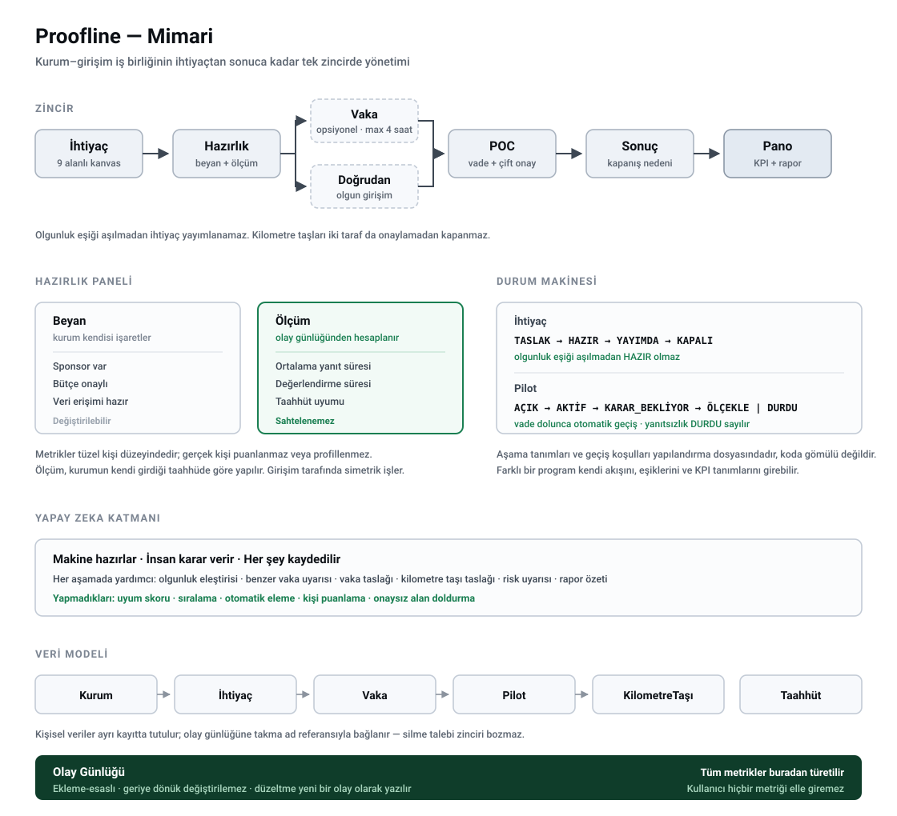

# Proofline

Kurum–girişim iş birliğinde hazırlığı beyanla değil davranışla ölçen açık kaynak omurga.

> Zemin360 İşlevsel Dijital İnovasyon Platformu Hackathonu için geliştirilmektedir.
> Kod geliştirme dönemi 18 Eylül'de başlar. Bu depoda şu an mimari, veri modeli ve geliştirme planı bulunmaktadır.

---

## Teşhis

Zemin360'ın tanımladığı altı problem birbirinden bağımsız altı sızıntı değil; tek bir hattın farklı noktalarındaki kayıplardır. O hat, bir kurumun ihtiyacını ilk kez yazdığı andan iş birliğinin sonucunun ölçüldüğü ana kadar uzanır.

| Problem | Hattın hangi noktası |
|---|---|
| #5 İhtiyaçların net tanımı | İhtiyaç yazılırken |
| #2 Profil & portfolyo doğruluğu | Karşı taraf değerlendirilirken |
| #3 Kurum–kişi eşleşmesi | Taraflar buluşurken |
| #1 Genç yeteneklerin keşfi | Buluşmanın çıktısı |
| #6 Şeffaf iş birliği takibi | İş yürürken |
| #4 Yaşayan bir ağ | İş bittikten sonra |

Bu problemleri ayrı ayrı çözmeye çalışmak altı ayrı ürün yapmak demektir. Hattın kendisini kurmak ise tek bir ürün yapmak demektir.

Hatta bugün eksik olan asıl şey ise listede yazmıyor: **kurum girişimi değerlendiriyor, girişim kurumu değerlendiremiyor.** Oysa iş birliklerinin önemli bir kısmı girişim yetersiz olduğu için değil, kurum hazır olmadığı için ölüyor — bütçe çıkmıyor, karar verici değişiyor, taahhüt edilen veri erişimi verilmiyor, karar süresiz erteleniyor. Girişim bunu ancak aylar sonra öğreniyor ve o ayları geri alamıyor.

---

## Tez

> Kurumsal iş birliğinde sadece girişimin uygunluğu değil, **kurumun da hazır olması** ölçülmeli.
> Ve hazırlık beyanla değil **davranışla** kanıtlanmalı.

Beyan sahtelenebilir; davranış sahtelenemez. Bir kurum "sponsorumuz var" diye işaretleyebilir, ama sorulara ortalama kaç saatte cevap verdiğini işaretleyemez — o sayı kendi davranışından çıkar.

---

## Zincir

```
                        ┌─→ Vaka ──────┐
    İhtiyaç → Hazırlık ─┤              ├─→ POC → Sonuç → Pano
                        └─→ Doğrudan ──┘
```

### 1. İhtiyaç

Kurum boş metin kutusu görmez; dokuz alanlı bir kanvas doldurur: problem, mevcut durum (baseline), ölçülebilir başarı kriteri, veri/sistem erişimi, kısıtlar, bütçe bandı, karar tarihi, karar verici, başarılı olursa sonraki adım.

Sistem her alan için bir **olgunluk skoru** hesaplar ve eksikleri işaretler. Yapay zeka metni güzelleştirmez, **eleştirir**: "Başarı kriteriniz ölçülemez — şu anki değeri ve hedef değeri girin." Skor eşiği aşılmadan ihtiyaç yayımlanamaz.

### 2. Hazırlık

Her ihtiyacın yanında iki sütunlu bir hazırlık paneli bulunur:

| Beyan (kurum söylüyor) | Ölçüm (sistem görüyor) |
|---|---|
| Sponsor var ✅ | Ortalama yanıt süresi: 6 saat |
| Bütçe onaylı ❌ | Değerlendirme süresi: 2 gün |
| Veri hazır ✅ | Taahhüt edilen veri teslim edildi ✅ |

Sol sütun kurumun kendi beyanıdır. Sağ sütun olay günlüğünden hesaplanır ve değiştirilemez.

Ölçüm dışarıdan dayatılan bir standarda göre değil, **kurumun kendi taahhüdüne** göre yapılır. Kurum pilot açarken "sorulara üç iş günü içinde döneceğiz" der; sistem yalnızca bu söze uyulup uyulmadığını kaydeder.

**Metrikler kurum düzeyinde tutulur, gerçek kişi düzeyinde değil.** Hiçbir kişi puanlanmaz veya profillenmez. Karşılaştırmalı sıralama üretilmez; sözünü tutan kurum rozet kazanır, tutmayan yalnızca rozetsiz kalır. Aynı ölçüm girişim tarafında simetrik olarak işler.

### 3. Vaka *(opsiyonel)*

Kurum, gerçek ihtiyacından **türetilmiş** bir vaka yayımlar. Birebir aynısı değildir: "şu 200 faturayı işle" değil, "fatura mutabakat problemimiz şu — 20 örnek üzerinde nasıl yaklaşırdın?"

Genç veya girişim çözer, kurum değerlendirir, profile **doğrulanmış bir kayıt** düşer. Kurum çıktıyı üretimde kullanmaz; değerlendirdiği şey yaklaşımdır.

Kurallar:
- Süre üst sınırı dört saattir
- Değerlendirme ölçütü başvurudan önce görünür
- Çözümün sahibi katılımcıdır; kurum üretimde kullanamaz
- Gerçek müşteri verisi kullanılamaz; vaka verisi anonim veya sentetiktir
- **Kurum, gelen çözümleri tanımlı süre içinde değerlendirmek zorundadır. Değerlendirmezse bu, hazırlık panelinin ölçüm sütununa yazılır.**

Son kural bu aşamayı tek taraflı bir sınav olmaktan çıkarır: genç dört saat harcar, kurum da değerlendirme süresiyle ölçülür.

Vaka zorunlu bir kapı değildir. Olgun bir girişim veya bölünemeyen bir ihtiyaç doğrudan pilota geçebilir. Sistem hangi yoldan gelindiğini kaydeder; bu, iki yolun başarı oranını karşılaştırmayı mümkün kılar.

### 4. POC

Pilot açılırken kapsam, kapsam dışı, sayısal başarı eşiği, veri/erişim taahhüdü, iki taraftan isimli sorumlu ve **karar tarihi** zorunludur.

Üç mekanizma çalışır:

- **Çift taraflı onay** — bir kilometre taşı iki taraf da işaretlemeden kapanmaz. İki ayrı tüzel kişi arasında hiyerarşi olmadığı için tek taraflı ilerleme yoktur.
- **Vade** — karar tarihi geldiğinde sistem her iki tarafa tek soru sorar: *ölçekle / durdur / bir kez uzat (gerekçeyle)*. Yanıt gelmezse "durdur" sayılır.
- **Değiştirilemez günlük** — her hareket kim/ne zaman/ne bilgisiyle kaydedilir ve geriye dönük düzeltilemez.

### 5. Sonuç

Pilot kapandığında sonuç belgesi otomatik üretilir ve iki tarafın profiline doğrulanmış kayıt olarak işlenir.

Kapanış nedeni zorunludur ve seçeneklidir: bütçe çıkmadı, karar verici değişti, veri erişimi verilemedi, teknik uyumsuzluk, girişim teslim edemedi, kurum içi öncelik değişti, başarılı — ölçeğe geçiyor.

Bu nedenler anonimleştirilerek birikir. Yeni bir ihtiyaç yazılırken sistem uyarabilir: "Benzer üç pilot yapıldı, ikisi veri erişimi verilemediği için kapandı."

### 6. Pano

Zincirin tamamı zaten kayıtlı olduğu için pano ayrı veri girişi gerektirmez; yalnızca toplar. Aktif kurum ve girişim sayısı, açık ve karara gelen pilotlar, ortalama aşama süreleri, en sık kapanış nedenleri ve program hedeflerine göre ilerleme tek ekranda izlenir; rapor tek tıkla dışa aktarılır.

Program hedeflerinin tanımı sabit değildir. "Eşleşme" ve "pilot" sayımının hangi aşamada yapılacağı yapılandırılabilir.

---

## Hangi problemleri çözüyor

| Problem | Zincirdeki karşılığı |
|---|---|
| #1 Genç yeteneklerin keşfi | Vaka — CV değil, çözülmüş ve değerlendirilmiş problem |
| #2 Profil & portfolyo doğruluğu | Vaka değerlendirmesi ve pilot sonucu, doğrulanmış kayıt olarak profile işlenir |
| #3 Kurum–kişi eşleşmesi | Çift taraflı hazırlık paneli |
| #4 Yaşayan bir ağ | Sürekli vaka akışı; profil ayrıca güncellenmez, iş akışının yan ürünü olarak güncellenir |
| #5 İhtiyaçların net tanımı | İhtiyaç kanvası ve olgunluk kapısı |
| #6 Şeffaf iş birliği takibi | Çift taraflı onay, vade motoru, değiştirilemez günlük |

Altı problemin altısına da dokunulur, ancak dördünde derinleşilir. Eşleştirme algoritması bilinçli olarak kapsam dışıdır: 10 kurum ve 20 girişim ölçeğinde istatistiksel olarak anlamlı bir model kurulamaz; kurulursa yalnızca gerekçesiz bir sıralama üretir. Sistem bunun yerine gerekçeli insan kararlarını yapılandırılmış biçimde kaydeder — bir model gerekirse eğitim verisi buradan çıkar.

---

## Neden mevcut araçlar yetmiyor

**"Bu Jira/Trello/Notion."**
Jira'yı kim kurar? Kurum. Kim yönetir? Kurum. Kim kapatır? Kurum. Yani girişimin gördüğü şey, kurumun görmesine izin verdiği şeydir; kurum kendi gecikmesini kendi sisteminde raporlamaz. Sorun araçta değil, aracın kime ait olduğundadır. İki tarafın da hesap verdiği bir kayıt, taraflardan birinin sunucusunda duramaz.

**"Youthall/Kariyer.net zaten var."**
Doğru — ve başarılılar; erişim problemi büyük ölçüde çözülmüş durumda. Ama Zemin360 yine de bu hackathonu açıyor. Demek ki problem erişim değil. Bir gencin bugün eksiği ilan görmemesi değil, hiç iş yapmamış olması. İlan sitesi bunu çözemez çünkü işi kendisi üretmez.

**"Bu bir CRM."**
CRM'in amacı sahibinin karşı tarafı yönetmesidir; buradaki kayıt ise ikisinin arasındaki anlaşmanın kaydıdır. CRM'de veriyi sahibi düzenler. Burada bir kilometre taşını iki taraf da onaylamadan kapatamazsınız ve geçmiş kaydı hiç kimse değiştiremez. Kendi sahibine "hayır" diyebilen bir şey CRM değildir.

---

## Yapay zeka

Sistemin **her aşamasında** yapay zeka çalışır; hiçbir aşamada son kararı vermez.

| Aşama | Yapar | Kararı veren |
|---|---|---|
| İhtiyaç | Olgunluk eleştirisi, eksik alan tespiti | Kurum |
| İhtiyaç | Benzer geçmiş vakaları bulup uyarma | Kurum |
| Vaka | Vaka taslağı önerisi, çözümün rubriğe göre ön incelemesi | Kurum |
| Pilot | Kilometre taşı taslağı, risk erken uyarısı | Taraflar |
| Sonuç | Sonuç belgesi taslağının derlenmesi | Taraflar |
| Pano | Ekosistem özeti, dönemsel brifing | Program yöneticisi |

**Yapmadıkları:** uyum skoru üretmez, sıralama yapmaz, otomatik eleme veya ret kararı vermez, kişi puanlamaz, hiçbir alanı kullanıcı onayı olmadan doldurmaz.

Tüm çağrılar tek bir servis katmanından geçer. Bu sayede yedeklilik, kişisel veri süzgeci ve sağlayıcı değişimi tek yerde çözülür; servis erişilemez olduğunda kural tabanlı karşılıklar devreye girer ve sistem çalışmaya devam eder.

Ayrıntı: [`docs/yapay-zeka.md`](docs/yapay-zeka.md)

---

## Mimari



### Veri modeli

```
Kurum
Kişi
İhtiyaç          → kurum, alanlar, olgunluk skoru, durum
Taahhüt          → ihtiyaç, kurumun kendi girdiği süre sözleri
Vaka             → ihtiyaç, rubrik, çözüm, değerlendirme
Pilot            → ihtiyaç, taraflar, karar tarihi, durum
KilometreTaşı    → pilot, iki taraflı onay durumu
Olay             → değiştirilemez günlük (append-only)
```

**Olay tablosu sistemin kalbidir.** Her hareket buraya yazılır, hiçbir kayıt silinmez veya değiştirilmez. Bütün metrikler buradan türetilir: yanıt süresi, değerlendirme süresi, taahhüt uyumu, aşama süreleri.

Olay kaydı aktörü doğrudan kimliğiyle değil bir **takma ad referansıyla** saklar; kişisel veriler ayrı kayıttadır. Bu sayede silme talebi geldiğinde kişi kaydı anonimleşir, zincirin bütünlüğü bozulmaz.

Ölçüm ayrı bir sistem değil, olay günlüğünün türevidir. Bu yüzden hem sahtelenemez hem de ayrıca veri girişi gerektirmez.

### Durum makinesi

```
İhtiyaç:  TASLAK → HAZIR → YAYIMDA → KAPALI
Pilot:    AÇIK → AKTİF → KARAR_BEKLİYOR → ÖLÇEKLE | DURDU
```

İki kural sistemin tamamını tanımlar:

1. `TASLAK → HAZIR` geçişi, olgunluk skoru eşiği aşılmadan gerçekleşmez.
2. `KARAR_BEKLİYOR` durumuna vade dolduğunda otomatik geçilir; yanıtsız kalırsa `DURDU` olur.

Aşama tanımları ve geçiş koşulları koda gömülü değil, yapılandırma dosyasındadır. Farklı bir program kendi akışını tanımlayabilir.

### Teknoloji

Next.js · TypeScript · PostgreSQL · Drizzle · Tailwind + shadcn/ui · Vercel · Docker Compose

Ayrıntı: [`docs/mimari.md`](docs/mimari.md) · [`docs/ekranlar.md`](docs/ekranlar.md)

---

## Kişisel verilerin korunması

Sistem 6698 sayılı Kanun gözetilerek tasarlanmıştır. Üç temel karar:

1. **Metrikler tüzel kişi düzeyinde tutulur.** Gerçek kişi puanlanmaz veya profillenmez.
2. **Münhasıran otomatik karar üretilmez.** Sistem gösterir; kararı insan verir. Bu, Kanun'un 11'inci maddesinin (g) bendindeki riski tasarımdan çıkarır.
3. **Olay günlüğü takma ad taşır.** Değiştirilemezlik ile silme hakkı birlikte sağlanır.

Özel nitelikli kişisel veri hiçbir alanda toplanmaz. Açık rıza yalnızca gerçekten opsiyonel olan tek bir yerde kullanılır (kamuya açık profil yayımı); diğer işlemelerin dayanağı sözleşmenin ifası ve meşru menfaattir.

Ayrıntı, aşama aşama hukuki dayanaklar ve açık konular: [`docs/kvkk.md`](docs/kvkk.md)

---

## Kapsam

Kapsam bilinçli olarak ikiye ayrılmıştır. Üçüncü sütun da en az diğerleri kadar önemlidir.

### Hackathon çıktısı (20 gün)

- Kimlik ve üç rol (kurum / birey-girişim / program yöneticisi)
- İhtiyaç kanvası, olgunluk skoru ve yayımlama kapısı
- Yapay zeka servis katmanı + kural tabanlı yedek
- Taahhüt girişi ve çift sütunlu hazırlık paneli
- Vaka akışı: yayımlama → çözüm → değerlendirme → doğrulanmış kayıt
- Pilot: kilometre taşları, çift taraflı onay, değiştirilemez olay günlüğü
- Vade motoru, karar formu, zorunlu kapanış nedeni
- Program panosu ve rapor dışa aktarımı

### Dört aylık geliştirme fazı

| Ay | İş |
|---|---|
| 1 | Gerçek operasyon akışıyla kalibrasyon, durum tanımlarının ayarlanması, aydınlatma metni ve veri işleme sözleşmesi, ilk kurumlarla saha testi |
| 2 | Kurumsal SSO, rol bazlı detaylı yetkilendirme, e-posta ve takvim entegrasyonu |
| 3 | Yapay zeka uçlarının kalan aşamalarda devreye alınması, pilot uygulamanın başlatılması |
| 4 | Çok programlı yapı, açık kaynak paketi (Docker, dokümantasyon, devir), kullanıcı eğitimleri |

### Bilerek yapmadıklarımız

- Eşleştirme algoritması veya uyum skoru
- Mesajlaşma, sosyal akış, bağlantı grafiği
- Blok zinciri tabanlı sertifika veya kimlik
- Mobil uygulama
- Rozet/puan/lider tablosu mekanikleri

Bunların hiçbiri 20 günde yapılamayacağı için değil, bu problemi çözmediği için kapsam dışıdır.

---

## Açık kaynak

Çıktının açık kaynak olması Zemin360 şartnamesinin gereği; ancak deponun herkese açık olması tek başına sürdürülebilirlik üretmez. Proje baştan devredilebilir tasarlanmıştır:

- **Lisans:** Apache-2.0 — MIT'ten farklı olarak açık patent hükmü içerir, kurumsal kullanımda daha güvenlidir.
- **Çok programlı yapı:** Her kayıt bir programa bağlıdır. Zemin360 ilk program, tek program değil. Başka bir kalkınma ajansı, teknopark, TTO veya hızlandırma programı aynı sistemi kendi verisiyle çalıştırabilir.
- **Yapılandırılabilir hedefler:** Program KPI tanımları koda gömülü değildir.
- **Tek komutla kurulum:** `docker compose up` ile ayağa kalkar; `.env.example` ve tohum veri seti depoda bulunur.
- **Yönetişim:** `CONTRIBUTING.md` ve `GOVERNANCE.md` ile katkı ve karar süreçleri tanımlanır.

---

## Ekip

İki kişilik ekip: **Taylan Akgün** ve **Yunus Hanifi Öztürk**.

Sabit bir frontend/backend ayrımı yoktur; her iki geliştirici de projenin tüm katmanlarında çalışır ve iş bölümü sprint bazında yapılır.

---

## Depo yapısı

```
proofline/
├── README.md
├── LICENSE                 Apache-2.0
├── CONTRIBUTING.md
├── GOVERNANCE.md
├── SECURITY.md
├── docker-compose.yml
├── .env.example
└── docs/
    ├── mimari.md           veri modeli, durum makinesi, metrik türetimi
    ├── ekranlar.md         altı ekranın akışı
    ├── yapay-zeka.md       aşama bazında kullanım ve sınırlar
    ├── kvkk.md             aşama bazında hukuki dayanak ve tasarım kararları
    ├── plan.md             20 günlük geliştirme takvimi
    └── mimari.svg          tek sayfa şema
```

Geliştirme planı gün gün [`docs/plan.md`](docs/plan.md) dosyasında ve GitHub Projects panosunda takip edilmektedir.
